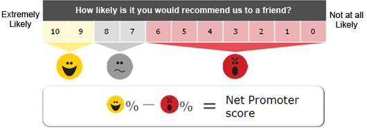
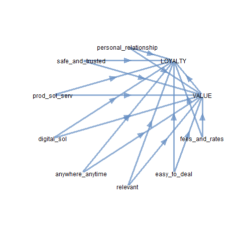
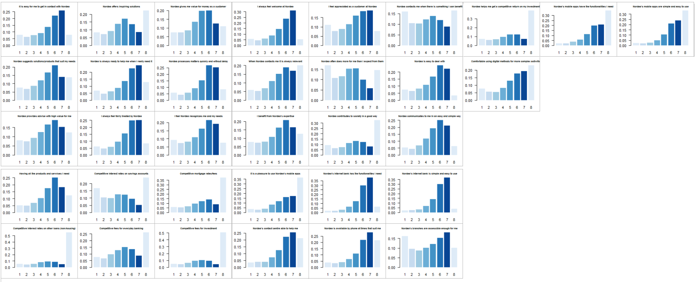

```{r global.options, include = TRUE, echo=FALSE}
knitr::opts_chunk$set(
    cache       = TRUE,     # if TRUE knitr will cache the results to reuse in future knits
    fig.width   = 8,       # the width for plots created by code chunk
    fig.height  = 6,       # the height for plots created by code chunk
    fig.align   = 'center', # how to align graphics in the final doc. 'left', 'right', 'center'
    results     = 'asis',   # knitr will pass through results without reformatting them
    echo        = FALSE,     # in FALSE knitr will not display code in the code chunk above it's results
    message     = FALSE,     # if FALSE knitr will not display any messages generated by code
    strip.white = TRUE,     # if FALSE knitr will not remove white spaces at the beg or end of code chunk
    warning     = FALSE)    # if FALSE knitr will not display any warning messages in the final document
```

background-image: url("nordea.png")
background-size: 70px
background-position: 5% 98%
class: middle

# Presentation Outline

1. Problem Definition 

2. PeB CPS Data Characteristics 

3. Analysis:

   - Existing approach 
   
   - Best possible alternative

---
class: inverse, middle, center
background-image: url(https://upload.wikimedia.org/wikipedia/commons/3/39/Naruto_Shiki_Fujin.svg)
background-size: contain

# Problem Definition

---
background-image: url("nordea.png")
background-size: 70px
background-position: 5% 98%
class: middle

# Business Needs

- Foster Nordea's Customer Experience (CX) plan to regain position as #1 

- Secure that insights from the Customer Proposition Survey (CPS) are interpreted and used correctly and effectively to guide CX improvement

- **Gain CX insights and produce actionable solutions**

<br/>

> Nordea is in urgent need of setting up a customer loyalty predictive model to help identify actionable drivers that, integrated with other tools, could ease gaining competitive advantages produced from CX.

---
background-image: url("nordea.png")
background-size: 70px
background-position: 5% 98%
class: middle

# Related Academic Literature

- Emphasis on the utmost importance of trust and loyalty to survive in the financial sector

- Customer satisfaction among the antecedents of customer trust and/or loyalty in the retail banking sector

- In general, framework of hypotheses tested using survey data & Structural Equation Models (SEM)

---
background-image: url("nordea.png")
background-size: 70px
background-position: 5% 98%
class: middle

# Semantics

- Measurement quality of fuzzy and complex concepts as satisfaction, trust and loyalty is **pivotal** 

- The Net Promoter Score (also known as NPS) is the main metric used in business organizations to inform the management on how loyal the customer is

<br/>

```{r echo = FALSE}
library(knitr)

```

---
background-image: url("nordea.png")
background-size: 70px
background-position: 5% 98%
class: middle

# Main Disclaimer  

- While NPS meets all the common requirements for a "useful" business metric (easy to measure, feels legitimate), many research papers debunk its myth 

- NPS is computed on a question that on the surface seems to be about customer loyalty, but in reality only asks about recommending the company

- Loyalty is a **multidimensional** concept, but Nordea's CPS data are collected with an NPS-based mindset: *de facto*, loyalty is based on a single-question metric 

---
class: inverse, middle, center
background-image: url(https://upload.wikimedia.org/wikipedia/commons/3/39/Naruto_Shiki_Fujin.svg)
background-size: contain

#  PeB CPS Data 

---
background-image: url("nordea.png")
background-size: 70px
background-position: 5% 98%
class: middle

# Quarterly Data Characteristics

- Demographic and socio-economic self-stated status (age, gender, income class, higher education)

- Up to 34 ordered response variables aimed at measuring the dimensions of service quality and relationship on a 1-7 scale

- Three main questions on the "target" measures on a 0-10 scale (Recommendation, Satisfaction, Likelihood of being customer in medium term)

- Main data-related problems:
   - <span style="color:blue">Survey design and representativeness questionable</span> and <span style="color:blue">lack of</span> proper conceptual framework, hence <span style="color:blue">proper measurements</span> 
   
   - High share of "don't know": e.g., in Q1 2018 <span style="color:blue">for some questions > 50% </span> and on average > 15% [[Link to response distribution](#48)]
   
   - High level of missing items: e.g., in Q1 2018 only <span style="color:blue">9.5% of complete cases</span> and <span style="color:blue">5,071 missing patterns on 14,583 observations</span> 
   
  
---
class: inverse, middle, center
background-image: url(https://upload.wikimedia.org/wikipedia/commons/3/39/Naruto_Shiki_Fujin.svg)
background-size: contain

# Analysis: Replicating the Existing Approach 

---
background-image: url("nordea.png")
background-size: 70px
background-position: 5% 98%

# Strategies to Cure Main Data Problems

1. Treatment of "don't know" as item non-response $\implies$ it adds up to missingness<sup>1</sup>

2. Expectation-Maximization (EM) algorithm used for treatment of missing data under the assumption of MAR: model the missing data mechanism and then proceed to make a proper likelihood-based analysis<sup>2</sup> 

   - [Link to "handling imputed data"](#43)
   - Variables used in imputation: `age`, `gender`, `country`, `segment`, `main bank`, `education` + all questions<sup>3</sup>
   
3. 0-10 scales reported to 1-7 using the following linear conversion: 
$$0 = 1 \text{ and } 10 = 7$$
$$\text{target value} = 1/3 + 2/3 * \text{current scale value}$$

.footnote[
[1] Respondents that have not completed the questionnaire excluded from data transfer.
[2] $m$ estimates of means and variances from $m$ bootstrap samples used to draw $m$ sets of imputed values by a form of regression analysis. 
[3] Analysis made by external agency only uses model questions to produce $m=1$ imputed samples.
]

---
background-image: url("nordea.png")
background-size: 70px
background-position: 5% 98%

# Driver Model: Curse of Dimensionality 
|<font size="1">Brief description of variables</font>|<font size="1">Variable name</font>|<font size="1">Scale</font>|<font size="1">Construct</font>|
|----------------------------------------------------------------------------------------|----------------------|----------------------|----------------------|
|<font size="1"> <span style="color:blue"> How likely is it that you would recommend Nordea to a friend or colleague?</span>|<font size="1"><span style="color:blue">recommend</span></font>|<font size="1">0-10</span></font>|<font size="1"><span style="color:blue">LOYALTY</span></font>|
|<font size="1"><span style="color:magenta">Nordea gives me value for money as a customer</span></font>|<font size="1"><span style="color:magenta">value.for.money</span></font>|<font size="1">1-7</font>|<font size="1"><span style="color:magenta">VALUE</span></font>|
|<font size="1"><span style="color:magenta">As a customer I benefit from Nordeas expertise</span></font>|<font size="1"><span style="color:magenta">expertise.benefit</span></font>|<font size="1">1-7 </font>|<font size="1"><span style="color:magenta">VALUE</span></font>|
|<font size="1">Nordea is always ready to help me when I really need it</font>|<font size="1">ready.to.help</font>|<font size="1">1-7 </font>|<font size="1">personal_relationship</font>|
|<font size="1">I always feel fairly treated by Nordea</font>|<font size="1">fairly.treated</font>|<font size="1">1-7 </font>|<font size="1">personal_relationship</font>|
|<font size="1">I feel appreciated as a customer at Nordea</font>|<font size="1">appreciated</font>|<font size="1">1-7 </font>|<font size="1">personal_relationship</font>|
|<font size="1">When I am in touch with Nordea I feel they recognize me and my needs as a customer</font>|<font size="1">recognized</font>|<font size="1">1-7 </font>|<font size="1">personal_relationship</font>|
|<font size="1">I always feel welcome at Nordea</font>|<font size="1">welcome</font>|<font size="1">1-7 </font>|<font size="1">personal_relationship</font>|
|<font size="1">Nordea contributes to society in a good way</font>|<font size="1">good.society.contribution</font>|<font size="1">1-7 </font>|<font size="1">safe_and_trusted</font>|
|<font size="1">Nordea offers inspiring solutions</font>|<font size="1">inspiring.solutions</font>|<font size="1">1-7</font>|<font size="1">prod_sol_serv</font>|
|<font size="1">Nordea suggests solutions and products that suit my needs and economy</font>|<font size="1">fitting.solutions</font>|<font size="1">1-7 </font>|<font size="1">prod_sol_serv</font>|
|<font size="1">Having all the products and services I need</font>|<font size="1">have.all.needed</font>|<font size="1">1-7 </font>|<font size="1">prod_sol_serv</font>|
<center><font size="0.5">Note: Bundled using mixed explorative and confirmatory FA via PCA on 0-100 range-standardized data (Pearson's corr.) </font></center>

---
background-image: url("nordea.png")
background-size: 70px
background-position: 5% 98%

# Driver Model: Curse of Dimensionality 
|<font size="1">Brief description of variables</font>|<font size="1">Variable name</font>|<font size="1">Scale</font>|<font size="1">Construct</font>|
|----------------------------------------------------------------------------------------|----------------------|----------------------|----------------------|
|<font size="1">Nordea's mobile apps have the functionalities I need</font>|<font size="1">mobile.functionalities</font>|<font size="1">1-7 |<font size="1">digital_sol</font>|
|<font size="1">Nordea's mobile apps are simple and easy to use</font>|<font size="1">mobile.easy</font>|<font size="1">1-7 </font>|<font size="1">digital_sol</font>|
|<font size="1">It is a pleasure to use Nordea's mobile apps</font>|<font size="1">pleasure.mobile</font>|<font size="1">1-7 </font>|<font size="1">digital_sol</font>|
|<font size="1">Nordea's internet bank has the functionalites I need</font>|<font size="1">internet.functionalities</font>|<font size="1">1-7 </font>|<font size="1">digital_sol</font>|
|<font size="1">Nordea's internet bank is simple and easy to use</font>|<font size="1">internet.easy</font>|<font size="1">1-7 </font>|<font size="1">digital_sol</font>|
|<font size="1">When I call Nordea's contact centre they are able to help me</font>|<font size="1">help.contact.center</font>|<font size="1">1-7 </font>|<font size="1">digital_sol</font>|
|<font size="1">When I need advice, it is easy for me to get in contact with a relevant person in Nordea</font>|<font size="1">easy.get.contact</font>|<font size="1">1-7</font>|<font size="1">anywhere_anytime</font>|
|<font size="1">Nordea is available by phone at times that suit me</font>|<font size="1">phone.availability</font>|<font size="1">1-7 </font>|<font size="1">anywhere_anytime</font>|
|<font size="1">Nordea's branches are accessible enough for me (opening hours and distance)</font>|<font size="1">branch.accessibility</font>|<font size="1">1-7 </font>|<font size="1">anywhere_anytime</font>|
|<font size="1">Nordea contacts me if and when there is something I can benefit from</font>|<font size="1">contact.to.benefit</font>|<font size="1">1-7 </font>|<font size="1">relevant</font>|
|<font size="1">When Nordea contacts me it is always relevant</font>|<font size="1">relevant.contact</font>|<font size="1">1-7 </font>|<font size="1">relevant</font>|
|<font size="1">Nordea often does more for me than I expect from them</font>|<font size="1">more.than.expected</font>|<font size="1">1-7 </font>|<font size="1">relevant</font>|
<center><font size="0.5">Note: 6 questions excluded due to redundancy or inappropriateness.</font></center>

---
background-image: url("nordea.png")
background-size: 70px
background-position: 5% 98%

# Driver Model: Curse of Dimensionality 
|<font size="1">Brief description of variables</font>|<font size="1">Variable name</font>|<font size="1">Scale</font>|<font size="1">Construct</font>|
|----------------------------------------------------------------------------------------|----------------------|----------------------|----------------------|
|<font size="1">Nordea processes matters quickly and without delay</font>|<font size="1">quickness</font>|<font size="1">1-7 </font>|<font size="1">easy_to_deal</font>|
|<font size="1">Nordea is easy to deal with</font>|<font size="1">easy.to.deal</font>|<font size="1">1-7 </font>|<font size="1">easy_to_deal</font>|
|<font size="1">Nordea communicates to me as a customer in an easy and simple way</font>|<font size="1">easy.communication</font>|<font size="1">1-7 </font>|<font size="1">easy_to_deal</font>|
|<font size="1">Competitive interest rates on savings accounts</font>|<font size="1">good.intrates.savings</font>|<font size="1">1-7 </font>|<font size="1">fees_and_rates</font>|
|<font size="1">Competitive mortgage rates/fees</font>|<font size="1">good.mortgage.rates</font>|<font size="1">1-7 </font>|<font size="1">fees_and_rates</font>|
|<font size="1">Competitive interest rates on other loans (not housing loans)</font>|<font size="1">good.intrates.other</font>|<font size="1">1-7 </font>|<font size="1">fees_and_rates</font>|
|<font size="1">Competitive fees for everyday banking</font>|<font size="1">good.fees.everyday</font>|<font size="1">1-7 </font>|<font size="1">fees_and_rates</font>|
|<font size="1">Competitive fees for investment</font>|<font size="1">good.fees.investments</font>|<font size="1">1-7 </font>|<font size="1">fees_and_rates</font>|
|<font size="1">Nordea helps me get a competitive return on my investments (e.g. stocks, bonds and funds)</font>|<font size="1">help.competitive.roi</font>|<font size="1">1-7 </font>|<font size="1">fees_and_rates</font>|
|<font size="1">How comfortable are you with using digital methods for more complex activities, like opening a loan or getting advice?</font>|<font size="1">pronness.to.digital</font>|<font size="1">1-7 </font>|<font size="1">fees_and_rates</font>|
<center><font size="0.5">Note: Decision on endogenous/exogenous variables is the product of estimation fine-tuning.</font></center>

---
background-image: url("nordea.png")
background-size: 70px
background-position: 5% 98%
class: middle

# Structural Equation Models

- Easily address large numbers of variables - endogenous and exogenous

- Among best integrated methods for measuring latent variables and assessing their structural relationships

- Embed crucial characteristics in the study of customer satisfaction and loyalty, defined as such a complex, fuzzy and abstract concept 

- Shortcoming: confirmative nature $\implies$ context-dependency

---
background-image: url("nordea.png")
background-size: 70px
background-position: 5% 98%
class: middle

# Structural Equation Models

```{r echo = FALSE}
library(knitr)
knitr::include_graphics("path diagram.png")
```

---
background-image: url("nordea.png")
background-size: 70px
background-position: 5% 98%
class: middle

# Our Structural Model

```{r echo = FALSE}
library(knitr)

```

---
background-image: url("nordea.png")
background-size: 70px
background-position: 5% 98%
class: middle

# Loadings 

```{r echo = FALSE}
# --- installing missing packages and loading them in the env
packages <- c("readxl", "plyr", "dplyr", "survey", "taRifx", "Hmisc", "corrplot", "ggplot2", "cluster",
              "FactoMineR", "Rmisc", "knitr", "caret", "DT", "kableExtra", "lfactors", "Amelia", "plspm", 
              "data.table", "devtools", "rmarkdown", "RColorBrewer", "plsdepot", "plspm", "naniar", "MVN", 
              "outliers", "dummies","tidyr", "kableExtra", "formattable", "reshape")
if (length(setdiff(packages, rownames(installed.packages()))) > 0) {
        install.packages(setdiff(packages, rownames(installed.packages())))  
}

invisible(suppressWarnings(lapply(packages, library, require, character.only=TRUE, quietly=TRUE)))

df_1 <- read.csv("~/Driver Model/Replicate Ennova Exercise/Final/Q1/outdata_q11.csv", header = TRUE)
df_1<- df_1[2:50]
Rescale <- function(x) round((x-1)/(7 - 1) * 100,5)
df_1[c(13:42,45:48)] <- Rescale(df_1[c(13:42,45:48)])
df_1$recommend<-df_1$recommend*10
df_1$satisfied<-df_1$satisfied*10
df_1$customer.12.months<-df_1$customer.12.months*10
df_1_main <-filter(df_1, dk==1)


personal_relationship <- c(0, 0, 0, 0, 0, 0, 0, 0, 0, 0)
safe_and_trusted <- c(0, 0, 0, 0, 0, 0, 0, 0, 0, 0)
prod_sol_serv <- c(0, 0, 0, 0, 0, 0, 0, 0, 0, 0)
digital_sol <- c(0, 0, 0, 0, 0, 0, 0, 0, 0, 0)
anywhere_anytime <- c(0, 0, 0, 0, 0, 0, 0, 0, 0, 0)
relevant <- c(0, 0, 0, 0, 0, 0, 0, 0, 0, 0)
easy_to_deal <- c(0, 0, 0, 0, 0, 0, 0, 0, 0, 0)
fees_and_rates <- c(0, 0, 0, 0, 0, 0, 0, 0, 0, 0)
VALUE <- c(1, 1, 1, 1, 1, 1, 1, 1, 0, 0)
LOYALTY <- c(1, 1, 1, 1, 1, 1, 1, 1, 1, 0)


loy_path <- rbind(personal_relationship, safe_and_trusted, prod_sol_serv, digital_sol, anywhere_anytime, relevant, 
                  easy_to_deal, fees_and_rates, VALUE, LOYALTY 
                  # customer_12_months, satisfied, high_value_advice, recognized, welcome
                  )

colnames(loy_path) <- rownames(loy_path)

# OUTER MODEL
# blocks and modes
loy_blocks <- list(13:17,18,19:21,22:27,28:30,31:33,34:36,37:42,c(45,47),43)
# modes (A = reflective, B = formative, blocks)
loy_modes <- c(rep("A", 10))
# apply plspm
loy_pls_1_main <- plspm(df_1_main, loy_path, loy_blocks, modes = loy_modes, scheme="path", scaled=FALSE
                           # boot.val=TRUE, br=200
                        )

# barchart of loadings
ggplot(data = loy_pls_1_main$outer_model,
       aes(x = name, y = loading, fill = block)) +
        geom_bar(stat = 'identity', position = 'dodge') +
        # threshold line (to peek acceptable loadings above 0.7)
        geom_hline(yintercept = 0.7, color = 'gray50') +
        # add title
        ggtitle("Barchart of Loadings") +
        # rotate x-axis names
        theme(axis.text.x = element_text(angle = 90))

```

<center><font size="0.5">Note: Based on PLS-PM. PLS algorithms coincide with standard algebraic solutions - usually involving an eigendecomposition.</font></center>


---
background-image: url("nordea.png")
background-size: 70px
background-position: 5% 98%
class: middle

# Partial Least Squares 

- Soft-modeling technique to estimate structural equation models

- Rooted in a couple of data model-building and computational ideas developed by Herman Wold in the 1960s

- PLS methods have proven to be valuable on both theoretical and practical aspects

- Provide a versatile platform for analyzing multiple relationships among one or more sets of variables - measured on some objects

- Attractive features:
    - deceptively <span style="color:blue">simple iterative mechanisms</span>
    - <span style="color:blue">ease of programming implementation</span>
    - estimation ideas anchored on the principle of least squares
    - marked geometrical flavor of projection-based methods
    - <span style="color:blue">inherent dimension reduction nature</span>
    - rich possibilities for data visualization
    - <span style="color:blue">strong inductive spirit</span>
    - fit within statistical learning approaches

---
background-image: url("nordea.png")
background-size: 70px
background-position: 5% 98%
class: middle

# Partial Least Squares 

- Two main branches of PLS approaches: the **Path Modeling** branch and the **Regression branch**

- The branches have produced two major movements that for the most part, have grown apart, remained disconnected; as of today a contemporary conciliatory culture has taken the best of both schools

- PLS-PM is the Partial Least Squares approach to Structural Equation Modeling

- PLS-PM is a statistical method for studying complex multivariate relationships among observed and latent variables

- PLS-PM is a data analysis approach for studying a set of blocks of observed variables in which each block can be summarized by a latent variable and that linear relations exist between latent variables

---
background-image: url("nordea.png")
background-size: 70px
background-position: 5% 98%
class: middle

# What do we "calculate" in a PLS-PM? 

- Estimation of the latent variable "scores"

- Quantification of the relationships in the model

PLS-PM sequential procedure stages:

1. Get the weights to compute latent variable scores

2. Estimate the "path coefficients" (inner model)

3. Obtain the "loadings" (outer model)

[Link to technical appendix](#44)

---
background-image: url("nordea.png")
background-size: 70px
background-position: 5% 98%
class: middle

# Iterative Algorithm

```{r echo = FALSE}
library(knitr)
knitr::include_graphics("algo.png")
```


---
background-image: url("nordea.png")
background-size: 70px
background-position: 5% 98%
class: middle

# PLS-PM Assessment 

Measurement models assessment:

1. Unidimensionality (for Reflective Models)
2. Loadings and Communalities
3. Cross-loadings

Structural model assessment:

1. $R^{2}$ determination coefficients
2. Redundancy
3. GoF

Validation via bootstrap

---
background-image: url("nordea.png")
background-size: 70px
background-position: 5% 98%
class: middle

# To Wrap Up
My Guess on Existing Analysis

- Treat "don't know" option as unanswered (missing), excluding customers who did not complete the survey from the analysis *tout court*

- Treat missingness as being MAR and use the EM (Expectation-Maximization) algorithm, transforming the data to be readable by the algorithm

- Rescale response variables (1-7 and 0-10) to 0-100

- Bundle indicator variables using judgement

- Perform analysis on imputed samples, combine and weight

- Weights computed using raking

<a href="https://nordea.sharepoint.com/sites/DMADS/Shared%20Documents/Forms/AllItems.aspx?id=%2Fsites%2FDMADS%2FShared%20Documents%2FRoutine%2FFinal" target="_blank">My Routine</a>

---
background-image: url("nordea.png")
background-size: 70px
background-position: 5% 98%

# Output of the Analysis

- The model is estimated by country and by country-segment and weighting applied post estimation<sup>1</sup>

- An importance-performance map provides guidance for the prioritization

- A one-unit point increase in performance (the score) of a dimension increases the performance the target (`LOYALTY`) by the value of the estimated total effect on the target (due to 0-100 range standardization)

- The "performance" is the average value of the latent variable score: high values indicate a greater performance


.footnote[
[1] Weights based on age, country and segment + profitability. The method used to compute the weights from exernal agency unknown; we used raking and excluded weights greater than 5. Left with nesting it into profitability weighting.
]


---
background-image: url("nordea.png")
background-size: 70px
background-position: 5% 98%
class: middle

# Example of Output

```{r echo = FALSE}
library(knitr)
knitr::include_graphics("output DK.png")
```

---
background-image: url("nordea.png")
background-size: 70px
background-position: 5% 98%
class: middle

# Comparison of Outputs DK-FI: External vs. Internal

```{r echo = FALSE}
library(knitr)
knitr::include_graphics("output_diff.png")
```

---
background-image: url("nordea.png")
background-size: 70px
background-position: 5% 98%
class: middle

# Comparison of Internal Outputs DK-FI: Unweighted vs. Weighted

```{r echo = FALSE}
library(knitr)
knitr::include_graphics("outputown_diff.png")
```

---
background-image: url("nordea.png")
background-size: 70px
background-position: 5% 98%
class: middle

# Main Concerns over Existing Analysis 

Model-wise:

- Model validation shows insignificant coefficients

- Some relationships are counter-intuitive (e.g. negative coefficient for `relevant` on `LOYALTY`)

Data-wise:

- Measurements

- Details of weighting and imputation 

---
background-image: url("nordea.png")
background-size: 70px
background-position: 5% 98%
class: middle

# Viable Alternatives?
1. Attempt to improve the current analysis using same data: a two-step approach that combines Bayesian Networks (BN) and SEM

2. Design a new end-to-end analysis that starts from conceiving a solid and consistent overarching framework: customer loyalty predictive model that employs a big data approach using attitudinal and behavioural data sources + customers' verbatim comments

> Option 1 seems the most feasible even in a short time span and could add further insights, in the worst case on why the experiment as it is fails at producing reliable and actionable results, in the best case improving the way data at hand are processed to that end

---
background-image: url("nordea.png")
background-size: 70px
background-position: 5% 98%
class: middle

# BN + SEM

- Using SEM to study service & relationship quality through customer perceptions is more than justified, **but** it has confirmative nature $\implies$ expert knowledge + certain important relationships could be missed

- The idea is then to use BN to explore the relationships between the dimensions which define the facets of satisfaction and loyalty related to SQ/RQ, followed by a second step which applies SEM to validate these relationships and the model as a whole

---
background-image: url("nordea.png")
background-size: 70px
background-position: 5% 98%
class: middle

# BN 

- A BN is a framework for reasoning under uncertainty, and is widely used for representing uncertain knowledge

- Quantitative component consisting of a joint probability distribution that factorizes into a set of conditional probability distributions, governed by the structure of a Directed Acyclic Graph (DAG)

- BN can be defined as graphic models of the interactions between a set of variables, where the variables are represented as the nodes of a graph and the interactions (direct dependences) as directed links (also known as arcs and edges) between the nodes

- The first step in a BN analysis is to learn both the structure, which has to be validated, and the parameters

- I used an automatic learning approach where the structure of the BN is provided by algorithms which learn the structure using only one database (constraint-based, scored-based, hybrid)

- Methodology explained in Cugnata et al. (2016) "Bayesian Networks in Survey Data: Robustness and Sensitivity Issues"

---
background-image: url("nordea.png")
background-size: 70px
background-position: 5% 98%
class: middle

# BN in Our Case

- Curse of dimensionality is still an issue $\implies$ dimensionality-reduction needed

- PCA on ordinal data with polychoric correlations used as exploratory analysis reveals poor measures (constructs of max. 3 items and some indicators left out)

- Robust BN structure found for both the latent constructs as in existing analysis and ones detected by PCA 

---
background-image: url("nordea.png")
background-size: 70px
background-position: 5% 98%


# BN in Our Case: "Judgement" Blocks
```{r echo = FALSE, out.width = "100%", out.height = "60%"}
knitr::include_graphics("C:/Users/G54670/Documents/Driver Model/BN and SEM/Analysis/BN/BN_unrestricted.pdf")
```

---
background-image: url("nordea.png")
background-size: 70px
background-position: 5% 98%


# BN in Our Case: "Judgement" Blocks
```{r echo = FALSE, out.width = "100%", out.height = "60%"}
knitr::include_graphics("C:/Users/G54670/Documents/Driver Model/BN and SEM/Analysis/BN/RobustBN_unrestricted.pdf")
```


---
background-image: url("nordea.png")
background-size: 70px
background-position: 5% 98%


# BN in Our Case: "Agnostic" Blocks
```{r echo = FALSE, out.width = "100%", out.height = "60%"}
knitr::include_graphics("C:/Users/G54670/Documents/Driver Model/BN and SEM/Analysis/Alternative/PCA driven/BN_unrestricted_alternative.pdf")
```


---
background-image: url("nordea.png")
background-size: 70px
background-position: 5% 98%


# BN in Our Case: "Agnostic" Blocks
```{r echo = FALSE, out.width = "100%", out.height = "60%"}
knitr::include_graphics("C:/Users/G54670/Documents/Driver Model/BN and SEM/Analysis/Alternative/PCA driven/RobustBN_unrestricted_alternative.pdf")
```


---
background-image: url("nordea.png")
background-size: 70px
background-position: 5% 98%


# BN in Our Case: "Agnostic" Blocks
```{r echo = FALSE, out.width = "100%", out.height = "60%"}
knitr::include_graphics("C:/Users/G54670/Documents/Driver Model/BN and SEM/Analysis/Alternative/PCA driven/NLPCA-RM action grid.pdf")
```


---
background-image: url("nordea.png")
background-size: 70px
background-position: 5% 98%
class: middle

# Relationship Validation via SEM

- SEM built using the dimension relationships obtained from the previous BN model

- Goodness-of-fit parameters of the structural model help ascertain the validity of the model

- All the relationships in the model tested in order to be significant at a pre-defined level of confidence. If not, they are removed

- Specifically, Pairwise Likelihood Method for Multi-group Structural Equation Modelling with ordinal variables and data with missing values attempted on the two specifications  


---
background-image: url("nordea.png")
background-size: 70px
background-position: 5% 98%


#E.g. Multi-group SEM DK-FI on Agnostic Constructs
```{r echo = FALSE, out.width = "100%", out.height = "60%"}
knitr::include_graphics("C:/Users/G54670/Documents/Driver Model/BN and SEM/Analysis/Q1/Total/Ex4FittedMeasEquivModel_AC.pdf")
```


---
background-image: url("nordea.png")
background-size: 70px
background-position: 5% 98%
class: middle

# Concluding Remarks

- Data-related problems, including survey design, impact in a relevant manner on the final analysis output   

- It is not clear whether the big estimated impact of `personal relationship` and `safe and trusted` on `LOYALTY` is simply the product of those constructs bearing a better quality in terms of embedded signal into predicting the target (e.g. because of no missingness to cure)

- Methods tested are promising on better-quality data

---
class: inverse, middle, center
background-image: url(https://upload.wikimedia.org/wikipedia/commons/3/39/Naruto_Shiki_Fujin.svg)
background-size: contain

# Appendix

---
background-image: url("nordea.png")
background-size: 70px
background-position: 5% 98%
class: middle, inverse

# Best Practices When Imputing 

```{r echo = FALSE}
options(fig.width = 3, fig.height  = 3)
library(knitr)
knitr::include_graphics("amelia.png")
```

[Back to Analysis](#11)

---
background-image: url("nordea.png")
background-size: 70px
background-position: 5% 98%
class: middle, inverse

# PLS-PM Formalized

Structural Model - Inner Relationships

1. Linear: $$LV_{j}=\beta_{0}+\sum_{i\rightarrow j}\beta_{ji}LV_{i}+error_{j}$$

2. Recursive

3. Predictor specification: $$E[LV_{j}|LV_{i}]=\beta_{0i}+\sum_{i \rightarrow j}\beta_{ji}LV_{i}$$
   $$cov(LV_{j},error_{j})=0$$

[Back to Analysis](#21)

---
background-image: url("nordea.png")
background-size: 70px
background-position: 5% 98%
class: middle, inverse

# PLS-PM Formalized

Measurement Model - Outer Relationships

1. Reflective: The latent variable is considered to cause the manifest variables

2. Formative: The manifest variables are considered to be the cause of the latent one

3. Linear: $$\text{reflective: }X_{jk}=\lambda_{0jk}+\lambda_{jk}LV_{j}+error_{jk}$$ 
$$\text{formative: }LV_{j}=\lambda_{0j}+\lambda_{jk}X_{jk}+error_{j}$$

4. Predictor specification: $$\text{reflective: }E[X_{jk}|LV_{j}]=\lambda_{0jk}+\lambda_{jk}LV_{j}$$
$$\text{formative: }E[LV_{j}|X_{jk}]=\lambda_{0j}+\lambda_{jk}X_{jk}$$

[Back to Analysis](#21)

---
background-image: url("nordea.png")
background-size: 70px
background-position: 5% 98%
class: middle, inverse

# PLS-PM Algorithm

1. Get the weights to compute the scores

2. Estimate path coefficients (inner model)

3. Obtain the loadings

Stage 1 is an iterative process in which the ultimate goal is to get the weights 

1. Initial arbitrary outer weights

2. External estimation (standardization and sign ambiguity)

3. Obtain inner weights: recalculate scores (choice of scheme among centroid, factor and path)

4. Internal approximation

5. Update outer weigths (choice between modes A and B)

[Back to Analysis](#21)

---
background-image: url("nordea.png")
background-size: 70px
background-position: 5% 98%
class: middle, inverse

# PLS-PM in Sum

- The goal of PLS is to obtain score values of latent variables for prediction purposes 

- The idea is to calculate estimates of latent variables as linear combinations of their associated indicators using a special linear combination

- One looks for a linear combination in such a way that the obtained latent variables take into account the relationships of the structural and the measurement models in order to maximize the explained variance of the dependent variables (both latent and observed variables)

- The core of the PLS algorithm is the calculation of the weights (for the linear combination) required to estimate the latent variables, based on how the structural and measurement models are specified

[Back to Analysis](#21)

---
background-image: url("nordea.png")
background-size: 70px
background-position: 5% 98%
class: middle, inverse

# Distribution of Responses 

```{r set-options, cache=FALSE, echo = FALSE}
options(fig.width = 3, fig.height  = 2)
library(knitr)

```

[Back to Data](#9)

